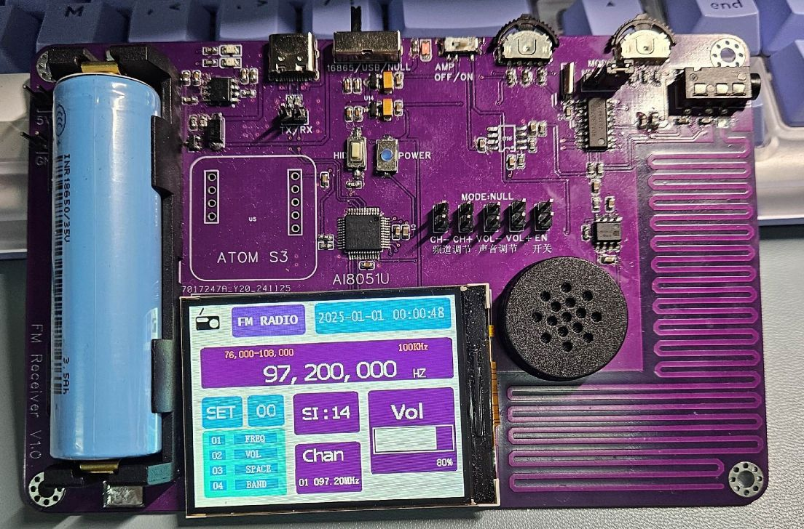

# FM Receiver – AI8051U + RDA5807FP

本项目是一款基于 **AI8051U 单片机** 与 **RDA5807FP** 的便携式 FM 无线电接收设备。  
包含完整的硬件设计、PCB 绘制、底层驱动、UI 系统与调试流程，功能完整，可独立工作。

本项目由本人独立完成，目标是学习射频接收、电源管理、嵌入式系统整合与 UI 实现的完整开发流程。

---

## ✨ 功能特性

- **FM 信号接收与解调**（基于 RDA5807FP）
- **频点调谐 / 音量调节**
- **耳机音频输出（AD8002D 功放）**
- **2.4 寸 IPS 屏 UI 界面**
- **波轮按键交互**
- **UART PC 调试接口**（可通过命令设置频率/读取系统状态）
- **电池供电 + Type-C 充电（TP4056）**
- **板载 RTC 时间显示（使用 AI8051U 内部 RTC）**

---

## 🛠 硬件设计

硬件包含以下模块：

- 主控：**AI8051U**
- 射频接收：**RDA5807FP**
- 音频功放：**AD8002D**
- 电源管理：**TP4056 + 18650 电池**
- 屏幕：**2.4 寸 240×320 IPS TFT**
- 交互：波轮按键
- 其他：XC6206 5V→3.3V LDO，Type-C 输入保护等

硬件目录：`/hardware/`

包含：

- schematic.pdf
- pcb_2D.png
- pcb_3D.png
- BOM.xlsx
- gerber/

---

## 💻 软件设计

固件基于 **C 语言** 开发，主要模块包括：

- `RDA5807FP.c / .h`：射频调谐驱动（I²C）
- `lcd.c`：LCD 驱动与局部刷新
- `ui.c`：菜单/频率显示/UI 状态机
- `Commands.c`：UART 调试指令解析
- `RTC.c`：基于 AI8051U 的 RTC 设置与校准

软件目录：`/firmware/`

---

## 📷 实物照片

---

## 📌 部分关键设计亮点

- **驱动从 0 编写**：RDA5807 系列寄存器解析、调频逻辑与信号质量判断均由本人实现。
- **轻量 UI 系统**：使用状态机 + 定时器局部刷新，显著减少 8051 系列 MCU 的刷新压力。
- **自制串口调试协议**：可快速测试频率、时间、状态等，不依赖上位机 GUI。

---

## 📈 项目成果

- 可稳定接收本地 FM 电台
- UI 响应时间 < **100 ms**
- 支持电池供电、可边充边用
- 音频输出噪声控制较好（使用 AD8002D）

---

## 🧩 不足与未来改进

- 天线阻抗匹配设计较为初级，后续计划使用 Smith Chart + 仿真优化。
- 代码耦合度偏高，未来希望迁移到轻量 RTOS。
- EEPROM 未利用，可扩展频道/音量等历史存储。

---

## 📚 仓库结构

FM-Radio-Receiver-AI8051U/
 │
 ├── README.md
 ├── hardware/
 ├── firmware/
 ├── ui/
 ├── docs/
 └── photos/

---

## 📄 License

本项目仅用于学习、展示用途，不作为商用产品。